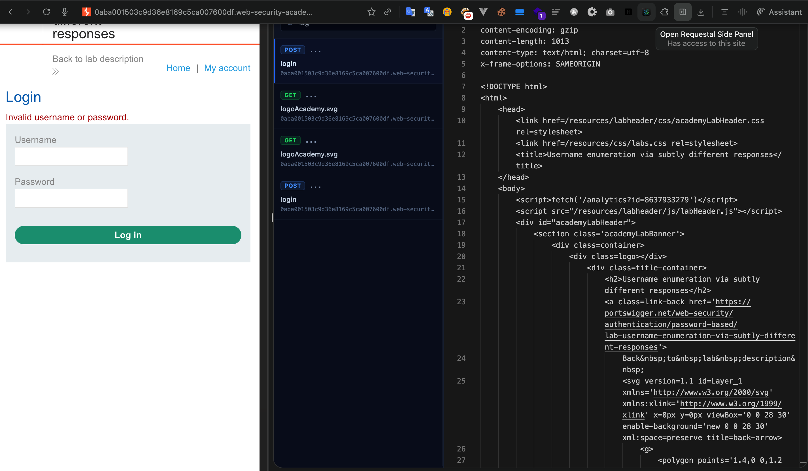
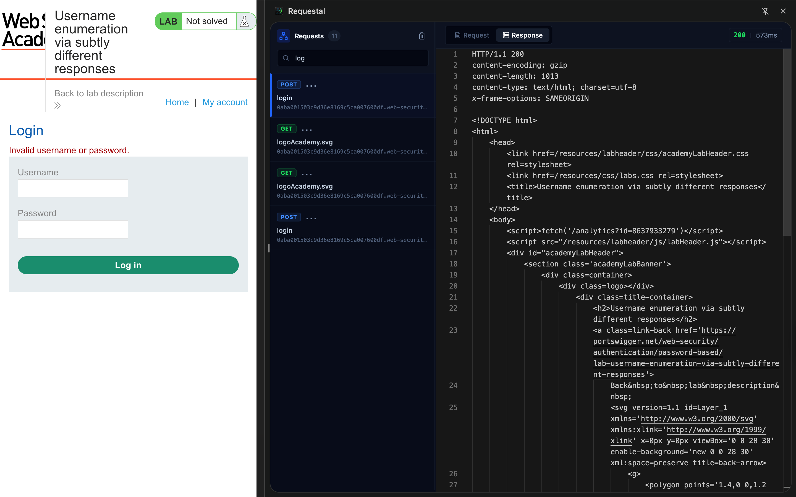
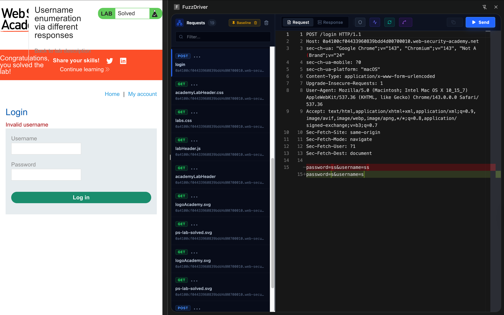
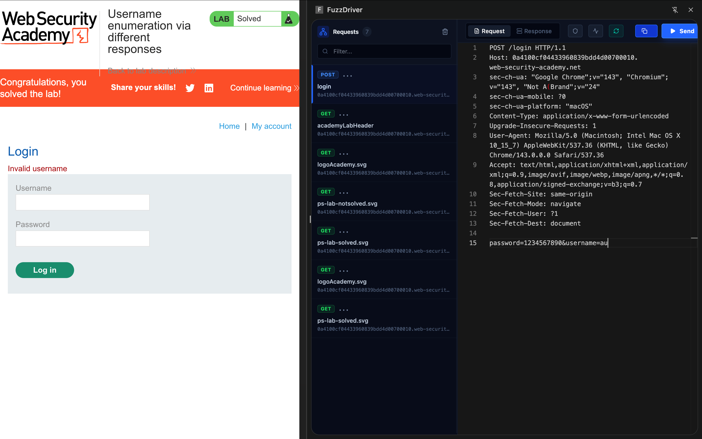

# Requestal: The Professional Fuzzing Workflow Extension




**Requestal** is a professional-grade Chrome DevTools extension designed to bridge the gap between manual web testing and automated fuzzing. It resides in the browser's Side Panel, allowing security researchers and developers to capture, analyze, modify, and replay network requests without leaving their workflow context.

Unlike standard network tools, Requestal focuses on **smart automation**—handling format conversions, eliminating noise in diffs, and enforcing RFC compliance—capturing the nuance of complex web interactions that command-line tools often miss.

---

## 🚀 Key Features

### Live Request Capturing & Filtering
Requestal listens to the browser's network stack in real-time.
-   **Follow Mode**: Automatically "tails" the traffic log, keeping the most recent request in focus.
-   **Smart Filtering**: Search by method (GET/POST) or URL keywords to isolate traffic.
-   **Clean Mode**: Strips ephemeral headers (e.g., `sec-ch-ua`, `cache-control`) to focus on the semantic core of the request.

### Body Format Synchronization ("Smart Format")
A unique engine that keeps the `Content-Type` header and the request body in sync.
-   **Auto-Conversion**: If you switch a header from `application/json` to `application/x-www-form-urlencoded` (or vice versa), the body content is automatically transcoded.
-   **RFC Enforcement**: Prevents invalid states, such as sending a JSON body with a Form header, by warning the user or blocking invalid "Smart Copy" actions.

### Send & Response System
An internal HTTP client allows for immediate verification of payloads.
-   **Dispatcher**: Executes requests directly from the extension context, preserving session cookies and credentials.
-   **Protocol Enforcement**: Automatically enforces `https://` and cleans unsafe headers (like `Host`) to prevent browser blocking.



-   **Response Diffing**:
    -   **Baseline Pinning**: Pin a request to store its "known good" state (both request and response).
    -   **Visual Diff**: Subsequent requests (e.g., after modifying a payload) are compared against the pinned baseline.
    
    

    -   **Smart Diff**: Ignores trivial changes (timestamps, nonces) to highlight only semantic differences (status codes, error messages).

---

## 🛠️ Usage Examples

### API Fuzzing Workflow
1.  **Capture**: Navigate to a target form. Requestal captures the `POST /login` request.
2.  **Pin**: Click "Pin" to establish this as the baseline.
3.  **Modify**: Edit the JSON body to inject a SQL payload.
4.  **Send**: Click "Send".
5.  **Analyze**: The "Response" tab immediately shows a diff where the server's error message appeared, ignoring the timestamp change in the header.



### Format Shifting
1.  **Capture**: Capture a standard JSON API request.
2.  **Toggle**: Determine if the server accepts URL Encoded data to bypass a WAF.
3.  **Action**: Change `Content-Type: application/json` to `application/x-www-form-urlencoded`.
4.  **Result**: Requestal's **Smart Format** engine instantly rewrites the body, e.g., `{"id":1}` becomes `id=1`.

---

## 💻 Technical Stack

-   **Frontend**: React 18, TypeScript, Vite, TailwindCSS
-   **Editor**: Monaco Editor
-   **Icons**: Lucide React
-   **State**: Chrome Storage & React State

## 📦 Installation & Development

1.  **Clone the repository**:
    ```bash
    git clone https://github.com/username/requestal.git
    cd requestal
    ```

2.  **Install dependencies**:
    ```bash
    npm install
    ```

3.  **Build for production**:
    ```bash
    npm run build
    ```
    The output will be in the `dist` folder.

4.  **Load in Chrome**:
    -   Open `chrome://extensions/`
    -   Enable **Developer mode**
    -   Click **Load unpacked**
    -   Select the `dist` folder

---

