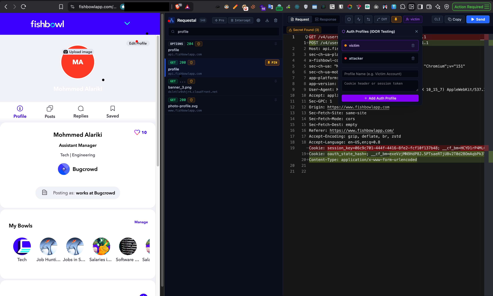

# Requestal: Professional Web Security, Interception & Fuzzing Extension




**Requestal** is an enterprise-grade Google Chrome Side Panel extension designed to bridge the gap between manual web penetration testing and automated CLI fuzzing. Built for security researchers, bug bounty hunters, and developers, Requestal captures, intercepts, format-shifts, replays, and diffs HTTP traffic directly within your browser workspace.

---

## 🚀 Key Features in V2.0

### 📡 1. Dual Capture & Live Traffic Interception (Pro Mode)
* **Standard Engine**: Captures full HTTP requests, multipart data, and 302 login redirects via `chrome.webRequest`.
* **Pro Mode Engine (CDP Debugger)**: Extracts full **response bodies** and JavaScript initiator call stacks using the Chrome DevTools Protocol.
* **Live Intercept / Breakpoints**: Pause in-flight requests and responses, inspect/modify headers and payloads in Monaco Editor, and forward or drop traffic in real time.

### 🔀 2. 1-Click Lossless Method Toggle (POST ⟷ GET)
* **POST ➔ GET**: Automatically moves JSON or Form bodies into URL query parameters, strips `Content-Type` / `Content-Length`, and clears the body.
* **GET ➔ POST**: Moves query parameters into the body, parses nested JSON objects, and intelligently restores `Content-Type: application/json` or `application/x-www-form-urlencoded`.

### 👥 3. Multi-Account Auth Profiles (IDOR Testing)
* Store session credentials for multiple roles (e.g. *Admin*, *Victim*, *Attacker*).
* 1-Click swap `Cookie:` and `Authorization: Bearer` headers directly inside the active request editor to verify broken object-level authorization (BOLA/IDOR).

### 🎯 4. Target Scope Management & Passive Secret Scanner
* **Scope Rules**: Define inclusion/exclusion regex patterns to isolate target applications and drop analytics/CDN noise.
* **Passive Secret Scanner**: Real-time detection of exposed AWS keys, Bearer JWTs, GitHub tokens, Stripe API keys, and Slack webhooks.

### 💻 5. Multi-Tool CLI Fuzzing Suite
* Instant command generation for **`curl`**, **`ffuf`** (clusterbomb with `FUZZ` placeholders), **`sqlmap`**, and **`nuclei`**.
* **1-Click `.req` File Download**: Save formatted raw HTTP requests directly to disk for command-line fuzzers (`sqlmap -r request.req`).

### 🔍 6. Dual Diff Engine (Text & Structural JSON)
* **Baseline Pinning**: Pin any "known-good" request/response as a baseline.
* **Smart Noise Reduction (`smartDiff`)**: Automatically masks volatile timestamps, nonces, and cache headers.
* **Structural JSON Diff**: Semantic key-level diffing displaying exact `+added`, `~modified`, and `-removed` metrics.

### ⚡ 7. IndexedDB Persistence & List Virtualization
* Stores 10,000+ requests persistently via Dexie IndexedDB with automatic LRU storage retention.
* Smooth 60 FPS scrolling powered by `@tanstack/react-virtual`.
* **HAR 1.2 Session Export**: Export complete traffic history for Burp Suite, Caido, and Wireshark.

---

## 🛠️ Usage Examples

### 1. IDOR & Access Control Testing
1. Navigate to target endpoint (`/api/v1/orders/102`).
2. Pin the request as **Baseline**.
3. Open the **Auth Profile** dropdown and select `Victim User B` session token.
4. Click **Send** and switch to **Diff View** to instantly inspect differences in status code and response payload.

### 2. Method Switching & Parser Confusion
1. Select a `POST /api/v1/search` request with a JSON body `{"query": "admin", "page": 1}`.
2. Click the **⇄ (Method Toggle)** button in the top toolbar.
3. Requestal converts the request to `GET /api/v1/search?query=admin&page=1` with cleaned headers.
4. Click **⇄** again to seamlessly convert back to `POST` with the exact JSON body structure restored.

### 3. CLI Fuzzing Bridge (`ffuf` / `sqlmap`)
1. In the Monaco editor, select any parameter value and press **Ctrl+Cmd+I** (or **Ctrl+I**) to inject `FUZZ`.
2. Click the **CLI** button to open the command generator drawer.
3. Copy the generated `ffuf -request request.req -request-proto https -w wordlist.txt` command or download the `.req` file directly.

---

## 💻 Tech Stack

- **Extension Framework**: Chrome Manifest V3 (MV3), Chrome Side Panel API, Chrome DevTools Protocol (CDP)
- **UI & State**: React 19, Zustand, TypeScript, Tailwind CSS v4, `@tanstack/react-virtual`
- **Editor**: Monaco Editor (`@monaco-editor/react`) with custom web workers
- **Database**: Dexie (IndexedDB) with LRU Retention Pruning
- **Icons**: Lucide React

---

## 📦 Installation & Development

1. **Clone the repository**:
   ```bash
   git clone https://github.com/mohmmedalariki/Requestal.git
   cd Requestal
   ```

2. **Install dependencies**:
   ```bash
   npm install
   ```

3. **Run tests & static analysis**:
   ```bash
   npm test
   npm run lint
   ```

4. **Build for production**:
   ```bash
   npm run build
   ```
   The compiled extension will be in the `dist` directory.

5. **Load in Chrome**:
   - Open `chrome://extensions/`
   - Enable **Developer mode**
   - Click **Load unpacked**
   - Select the `dist` folder in your project directory
